<div align="center">


# Claude Code Tray

**A native Windows tray monitor for your Claude Code usage — at a glance, always on.**

A WinForms (`NotifyIcon` + GDI+) rewrite that lives **only in the Windows tray** and
shows your **rate-limit usage percentage** as a crisp, DPI-aware icon.


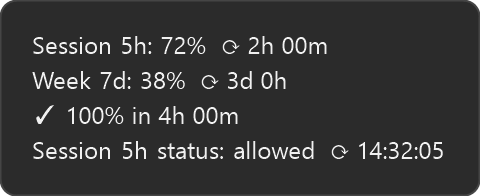
&nbsp;&nbsp;


</div>

---

> **Unofficial / community project.** Not affiliated with, endorsed by, or sponsored by
> Anthropic. "Claude" and "Claude Code" are trademarks of Anthropic; this tool merely reads
> the usage data Claude Code already exposes on your own machine.

Why .NET instead of Python: the number is drawn as a **vector** (`GraphicsPath`,
with an outline), **at the actual size** the tray requests (`SM_CXSMICON`) and with
**DPI awareness** (`PerMonitorV2`). No downscaling a 64px bitmap — the number stays
crisp, especially on 125–200% displays (20–32px icons).

## Install

The quickest way is the **Windows Package Manager** (winget):

```
winget install alegauss.ClaudeCodeTray
```

Or download `ClaudeTray-Setup.exe` from the
[latest release](https://github.com/alegauss/claude-tray/releases/latest) and run it — a
per-user install (no admin). Either way, the app self-updates from GitHub Releases afterwards.
To build from source instead, see [Build and run](#build-and-run).

## Look

- Background: Claude clay/coral `#D97757`
- **Vertical fill bar** (Task Manager style) rises from the bottom up, proportional to usage
  (50% = bottom half; 100% = whole tile). **Blue** normally; turns **vivid red** when the
  projection says usage will hit 100% **before** the window resets (see below). Prefer to see
  quota *left* instead? **Settings → Display → Show remaining instead of used** inverts it — the
  icon starts full at 100% and drains to 0%, and the tooltip reads "… left" (color and alerts
  are unchanged)
- **3D bevel border**: light highlight on the top/left and shadow on the bottom/right → relief
- Number: large digits with a **dark outline** (readable at any size), and their colour says what the
  number is about — **white** for the 5h session, **yellow** for the 7d week, and **orange whenever
  extra usage is paying**, whichever window the figure belongs to. Orange means *paying*, never
  *stopped*: a window that is simply spent keeps its own colour. This is what carries the news in
  *remaining* mode, where *0 left* draws no fill bar at all and the digits are the only thing on the
  tile left to say it
- Near the limit: the background flashes — at the threshold **the API itself names** on the response
  that crosses it, falling back to ≥90% on the readings where it names none
- Amber = API error · while connecting (before the first reading) it shows the **app logo**

The **app icon** (`.exe`, installer, shortcuts) is the same clay tile with a white spark mark —
generated as a multi-resolution `.ico` from the same GDI+ renderer (`ClaudeTray.ico`).

Tooltip (hover): 5h session, 7d week, extra usage, countdown to reset, the **projected
time to 100%** (labelled with the active window, e.g. *Week 7d projection*), and the status the
rate limit reports **for that same window** — *Week 7d status: allowed*, never a word about a
window you aren't watching. While extra usage is paying it also says **since when** — *paying since
3h 20m* — measured from the first reading past your included quota. If the app wasn't watching when
you crossed, it says nothing rather than counting from the day its log starts. A tray tooltip is
capped at 127 characters by Windows, so this line shortens before anything else does — first to
*since 3h 20m*, then to **`← 3h 20m`**, an arrow pointing back at the line above it. The arrow means
*elapsed*, and it is never `⟳`, which everywhere in this tooltip means *time remaining*.

In two languages even the arrow didn't fit, and there the tooltip drops **the window you are not
watching** — the 5h line while the icon shows the week, or the reverse — rather than say nothing about
money being spent. That is the only thing that can displace a reading, it happens only while extra
usage is paying, and it never happens to buy the bare arrow: a percentage is given up for words or
not at all.

## Projection (observability)

Beyond the current percentage, the app projects when usage would reach 100% and warns you
*before* the window resets. Two verdicts drive the fill-bar color:

- **on track** — usage stays under 100% until the window resets → the fill bar stays its
  normal blue (no extra signal)
- **danger** — usage hits 100% *before* the reset (you'll run out early) → the fill bar turns
  **vivid red**

At 100% there is a third thing the tile can mean, and it gets its own color:

- **extra usage is paying** — you're past the quota included in your plan and still working,
  because the account has extra usage enabled → the fill bar turns **clay**, not red. Red means
  *stopped*; clay means *this is costing money*. The tooltip says which — and **how long it has been
  going on**, because "you are paying" invites "since when", and the answer is what makes the next
  hour of work a choice rather than something you find at the end of the month. The **System
  information** page tells you whether the allowance is merely enabled or actually in use. In the
  **Statistics** window each pane's verdict chip goes clay and reads **Extra usage** — instead of the
  red *At limit*, which on a quota surface means *stopped* — for as long as that pane's own readings
  say the spell is still running

How the verdict is computed depends on the window:

- **Week 7d — pace line.** The weekly window uses a proportional rule: it compares your
  current usage against the share an even, constant burn would have spent by now
  (`elapsed ÷ 7 days`). If you're above that line, it's *danger*. The projected time to 100%
  is a rule-of-three from your average pace since the window started
  (`elapsed × (100 − used) ÷ used`). This needs no history — it's accurate from the first
  reading — and a short burst over a 7-day window won't trip a false alarm the way a slope
  fit would.
- **Session 5h / Extra — burn rate.** These keep a short rolling history of utilization
  samples, estimate the slope by least-squares regression, and project exhaustion from the
  current pace. They kick in after a couple of polls (~5–10 min), once there is enough
  history to trust the trend.

The bar color and the tooltip's projected time follow whichever metric you have **Show on
icon** set to (session 5h, week 7d, or extra). Resets are detected and clear the history.

**Once the quota included in your plan is gone, the number follows the account instead of your
pick.** A 5-hour session with room left cannot report quota the account no longer has, so the icon
reports the window that actually crossed: **0% left**, or **100% used**, whichever way you display
it. Your pick is remembered and comes back when that window resets, and the tooltip names the window
the number is about. Setting **Show on icon** to *Extra* is the exception — that is the window an
account past its included quota is in, so it is never moved off it.

### The weekly chart is paced to your hours, not the clock

In the **Statistics** window, the weekly projection doesn't spend quota uniformly across the
days ahead — a straight line does that, and it can put "you run out here" at 03:59 on a Friday,
a time nothing is running. Instead the app measures **when you are usually active** (day-of-week
× hour, from the timestamps in your local transcripts) and spends the remaining quota along that
shape: flat through the stretches you're normally idle — shaded faintly and labelled *usually
idle* — and sloped through your working hours.

It's a habit, not a schedule, so the wording hedges ("around 13:45"). It needs about three weeks
of history; below that the chart falls back to the straight average-pace line rather than drawing
a confident-looking staircase on thin data.

The shape starts out read from your local transcripts, which have one blind spot: usage from
another machine or from claude.ai counts against the same limit while leaving no transcript here,
so an hour that looks idle locally may not have been. As the app runs it builds a second version
of the same week from **your logged rate-limit readings**, which do count that usage wherever it
came from — and takes over hour by hour as it earns the coverage, so the blind spot closes
gradually instead of all at once. The method note (ⓘ) says which source the shape currently comes
from — it is filed under a heading per surface (*the numbers and the curve*, *the weekly
projection*, *the Throughput charts*), so the paragraph about **your** evidence is one to find
rather than one to read past. The even-pace line, the verdict chip and the tray icon are
deliberately **not** activity-aware — quota drains in wall-clock time whether or not anyone is
typing.

### Live throughput — what is burning right now

Under each chart there are **two numbers on two clocks**. The **window average** is the whole
window's tokens divided by the time since it opened — on the weekly tab that denominator is a full
week, so the number barely moves, and that is correct: it answers *what did this week cost*. Under
it, **Now ≈ N tok/s** answers *what is happening this minute*.

The moving picture behind that number has its own tab, **Throughput**: two charts of the last three
minutes — one line per **project** above, one per **token type** below — plus both window averages
underneath them for scale. It lives there rather than under each chart because it is the one thing in
this window that has *no* window scope: "now" is the same on the 5-hour and the weekly tab, so it used
to be the same picture twice, at a third of the height.

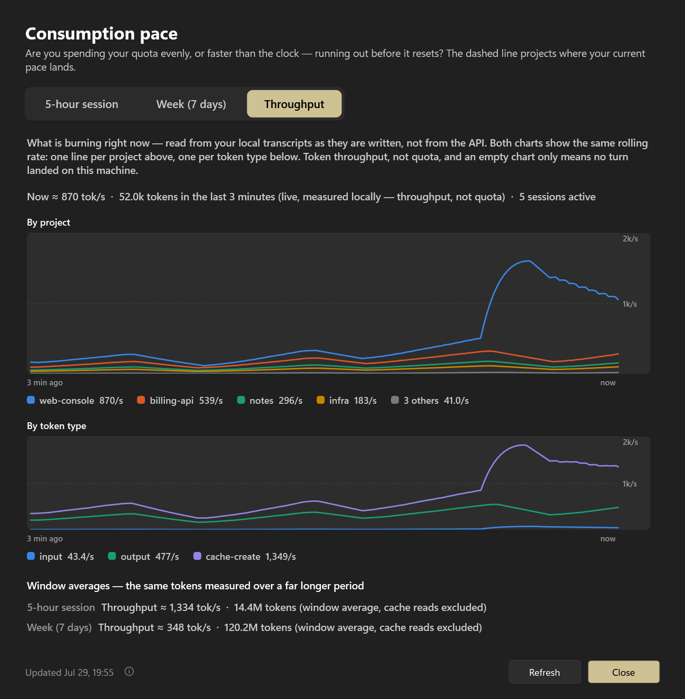

What the lines plot is the **rolling rate** — the same trailing-60-second number printed above them,
sampled once a second. That matters for a reason worth stating: a turn's tokens are recorded in the
second it *finished*, so the raw per-second counts are events, and joining events with a line would
draw a rate that never existed. A rolling rate is continuous — it slides down through a pause because
the work really is ageing out of the window, and climbs again when new work lands — and its right-hand
end is exactly the number above the chart.

Both charts are always drawn, and each project keeps its colour and its place in the legend for as long
as it is on screen. Nothing switches views or changes hands while you're reading it, and a repo that
goes quiet decays toward zero and ages off the left edge instead of vanishing.

Full height is a round number labelled on the right — `2k/s`, with half of it on the dashed line — so
a line's height is a quantity you can read. It is normally the highest point on screen, rounded up; when
one large cache write towers over everything else, the axis falls back to the **95th percentile** of the
samples and the stretch above the ceiling is drawn **dashed along it**, never silently cut.

Under both charts, one line says what the **cache re-read** is costing — on ordinary traffic here,
~30,000 tok/s against ~150 tok/s of real work. Every rate on the tab excludes it, because it barely
weighs on the rate limit, but an exclusion that large deserves saying out loud: it is your context
being re-sent with every turn, which makes it the per-turn price of a large eager context. **Context
load** measures that context itself.

**Point at a chart and it tells you what that second was.** A crosshair snaps to the nearest second,
a dot marks every line, and a readout names the time, each series' rate through it and the tokens that
actually *landed* in it. Those last two are different numbers on purpose: the rate is a trailing
minute, so a second that carried nothing can still sit high on the line — that is earlier work ageing
out, and the reading says so. When something is being clipped at the ceiling, the readout says that too.

The charts scroll because the axis they scroll along **is time** — the motion is the data, not a
spinner. When nothing is generating they go flat and stop repainting, and they only run at all while
the window is actually on screen. Everything is read from your local transcripts as they are written,
with no extra API calls: the rate-limit polling cadence is unchanged.

Both numbers are **token throughput, not quota** — the rate limit is a separate weighting the app
only learns from the API. And an empty chart means *no turn landed on this machine*, not that
nothing is running: work on another machine or on claude.ai leaves no transcript here.

If you run Claude Code in **more than one repo at once**, that upper chart is the answer to the
question you actually have — not *how fast* but *where*. The heaviest four repos get a line and a
direct label with their own rate; anything past that folds into a single grey "others", and the row
above says how many **conversations** are active — one per conversation, so a `/workflow` that fanned
out to eleven agents still counts as the one session you started. Active means *something was written
to its transcript in the last two minutes*, which is deliberately broader than "answered": a tab
waiting on a three-minute build is still working and still counted. A terminal left open and untouched
is not.

`ClaudeTray.exe --activity` prints the measured week as a heatmap if you want to see the shape
the projection is following.

### Where it went — the Sessions tab

The other three tabs answer *how much is left* and *how fast is it going*. A fourth one answers
**where did it go**, and that question is only askable against a list of nameable things — the
projects strip names four repos and an "others" bucket, which is the right resolution for a chart and
the wrong one for a search.

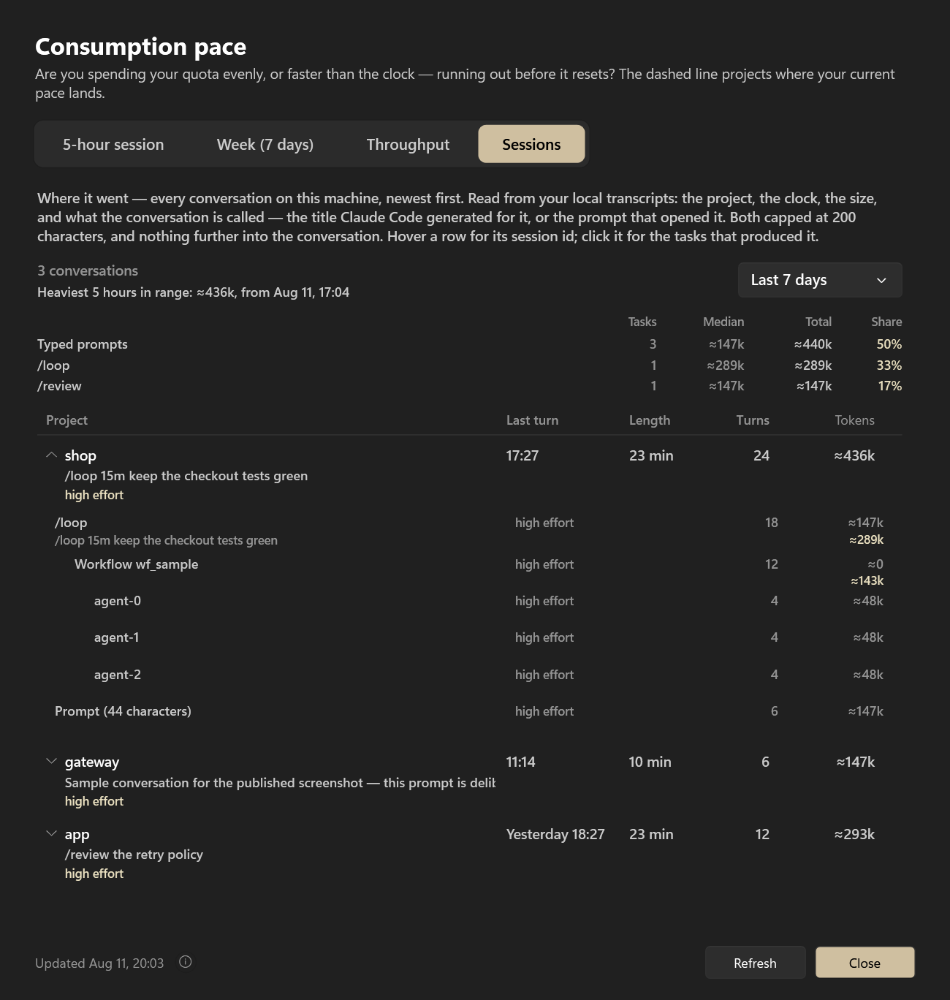

One row per **conversation**, newest first: project, when its last turn landed, how long it ran, how
many turns and how many tokens. A fan-out is one row, not twelve — a workflow's agents are folded into
the session that spawned them, which is where their cost actually belongs. Sort by clock or by tokens
on the column header, and pick the range: the last 7 days by default, 30 days, or everything on disk.

Under each project sits **the prompt that opened the conversation, truncated to 200 characters** —
the one place in this app that shows something you wrote, and the reason it exists is that there is
nothing else to show: Claude Code stores no title anywhere, and what `/resume` displays as one is your
own first message. The cap is applied before the text is stored, so the cache never holds more than
the row does; nothing further into the conversation is read, and no other screen, toast, report or
published screenshot carries it. The hover adds the session id — the string `claude --resume` takes.

**Open a row and it becomes a stack trace of that conversation.** A task starts every time you ask for
something and ends when you ask for the next thing, so the row unfolds into the tasks that actually
produced it — and under each one, the workflows and agents it fanned out to. Every node carries **its
own cost beside its subtree's**, which is the reading a single total cannot give you: a coordinator
that spent 300k under a fleet that spent 900k is a very different afternoon from one that spent it all
itself.

Task nodes name a slash command by its name and a typed prompt by its **length**, not its text — the
line the opening prompt is the single exception to.

`ClaudeTray.exe --sessions` prints the same list in a terminal, with `--all`, `--project <name>` and
`--refresh`; `--sessions <session-id>` prints one conversation's call tree.

**It also tells you what to do about it.** When the shaped projection says you'll run out early,
the sentence under the chart doesn't stop at the warning — it names the earliest hour you could
stop and resume at and still finish the week under the limit: *"Stop now and pick it back up
around Jul 30, 13:00, and you'd close the week at about 97%."* Only hours you normally work are
offered, and if no resume time would actually save the week, no advice is given rather than a
made-up one.

**Last week, behind this week.** The weekly chart also draws the previous week's burn-up as a
faint line on the same axes, so "is this week worse than the last?" is answerable at a glance
instead of from memory. Hovering its end shows where last week finished and where it stood at
this same point in the week. It appears once there are two weeks of history to draw it from, and
stays hidden if too much of that week went unrecorded — a line drawn from hours the app wasn't
running would look like a quiet week, which is exactly the wrong conclusion.

If that week ran past the quota included in your plan, the stretch it was over is marked in **clay at
the 100% line** — never as a column across the plot. Both weeks share one x-axis here, so a shaded
column would belong to neither, and the mark sits where the claim does: being past the included quota
*is* being at 100%. If the app only saw that week in pieces its faint line can read lower than the
mark, and hovering says so — the line is a floor, not the whole week. A week older than the app's
record of any of this answers **nothing** rather than claiming it stayed inside.

**Extra usage, on an axis of its own.** If you go past the quota included in your plan and keep
working, the chart draws what you're spending past it as a **clay** line — with its **own
right-hand scale**, never against the 0–100% one. The two are percentages of different things: the
left axis is "of the quota included in your plan", and the clay line is **of your extra-usage
allowance**, a window with its own limit and its own reset. Sharing one axis would read as one
number twice. It's not a second projection: "when do you run out" has already been answered.

That right-hand scale is the one thing **Show remaining instead of used** does not invert, and it
cannot be: the API tells the app what share of the allowance you have *spent* and never how big the
allowance is, so there is no "left" figure to flip to. With the setting on you therefore get one line
falling as your quota runs out and the clay one climbing as the allowance goes — so both the axis and
its legend entry say **spent**, and the two never claim to be measuring the same direction.

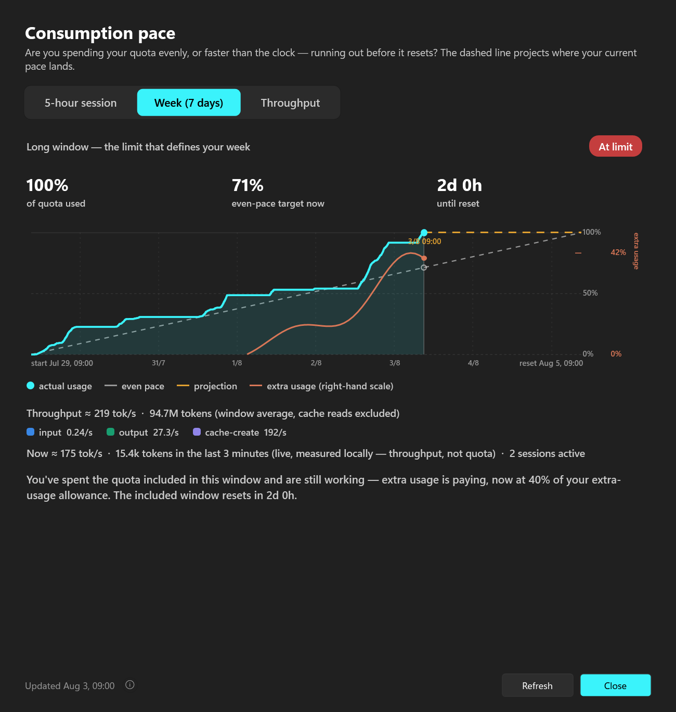

**And when there is no figure, there is still a stretch.** Some accounts spend past the included
quota with the allowance percentage reading **0%** the whole time — the API says *you are over*
without saying *by how much*. The chart then shades the stretch you were over in clay, behind the
usage line, and says so in words: extra usage is paying, and no header states what it amounts to.
No second axis appears, because there is no figure to rule one with. The app would rather show you
when it happened than invent how much.

**On both tabs, because it is a fact about the account.** Being past your included quota isn't a
property of a five-hour stretch or of a week — so the shaded stretch and the extra-usage axis appear
on whichever chart you're looking at, and each tab's legend names what that tab actually drew. The
weekly one has a single entry, **past your plan's quota**, covering both clay marks it can carry: this
week's shaded stretch and last week's mark at the ceiling. One fact about two different weeks — so the
entry names the fact, and its swatch and its hover describe only the shapes that particular chart
actually drew. Last week over and this week inside its quota is the common case, and there the entry is
the ceiling mark alone; the 5-hour tab has no previous window at all, so it is always the shaded stretch
alone. An entry never mentions something that isn't on the chart in front of you.

## ✨ Reset notifications — color-coded, at a glance

When a usage window hands your quota back, the app celebrates it with a **bespoke, on-brand
toast** that slides up from the bottom-right: a confetti burst and the quota bar visibly
**refilling** to its new level. It deliberately replaces the plain Windows balloon — a reset is
good news, so it should feel like it.

Each kind of reset gets its **own color and headline**, so you know what happened the instant it
appears — without reading a word:

<div align="center">

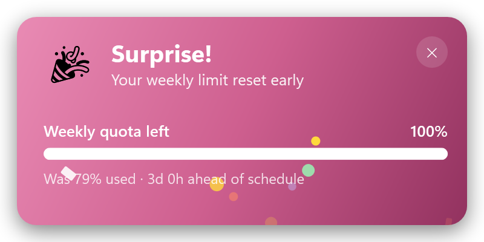
&nbsp;


&nbsp;


</div>

| Notification | Color | What it means | Setting |
|---|---|---|---|
| 🎉 **Surprise!** | **Clay/coral** | Your weekly limit reset **early** — ahead of its scheduled deadline | Unexpected reset |
| 🎉 **Bonus!** | **Violet** | A partial mid-window **credit** dropped your weekly usage (e.g. 91% → 50%) | Unexpected reset |
| ✦ **New week!** | **Teal** | The routine **weekly** reset — fresh quota for the week | Scheduled reset |
| ✦ **Fresh session!** | **Blue** | The **5-hour session** window reset — fresh for the next 5 hours | Session reset |

The two weekly anomalies (early reset, mid-window credit) are known Claude Code quirks worth
knowing about; the routine weekly and session resets are calmer "your quota's back" pings. **All
are on by default** — toggle any of them independently in **Settings** (click the icon → Settings),
so you can keep the surprises and silence the routine ones, or vice versa.

### Three that aren't celebrations

Not every thing worth knowing is good news. These use the same card without the confetti:

<div align="center">

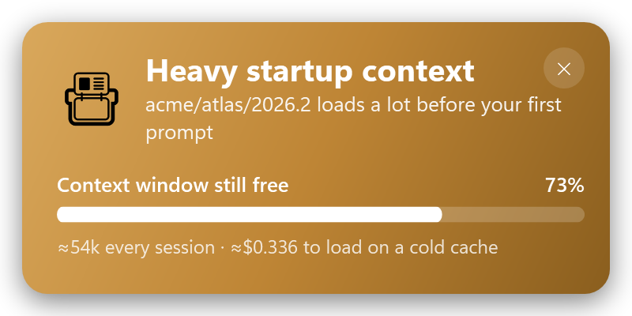
&nbsp;
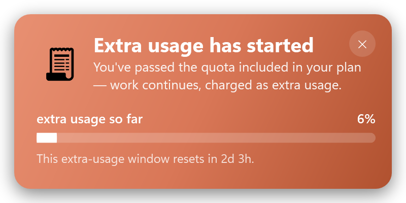

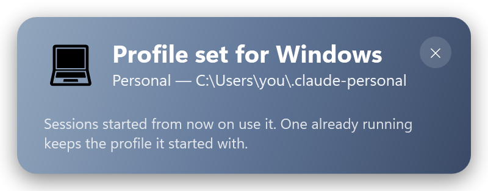

</div>

| Notification | Color | What it means | Setting |
|---|---|---|---|
| 📇 **Heavy startup context** | **Ochre** | A project's instruction files, memory and skills have grown enough that **every session pays for them before you type** — with what a cold-cache load costs | Context growth (**off** by default) |
| 🧾 **Extra usage has started** | **Clay** | You've passed the quota included in your plan and work is now being **charged as extra usage** | Extra usage starts |
| 💻 **Profile set for Windows** | **Slate** | The machine-wide profile switch **landed** — with the directory it wrote, or, if the write didn't take, what `CLAUDE_CONFIG_DIR` still reads | — (only when you switch) |

Writing the machine-wide profile is the least visible thing this app does: nothing on screen changes,
and you can't see the effect until you start another program. So it's the one action that confirms
itself — **only** when you switch by hand, once per switch, and only once the variable has been read
back to check the write actually took. It has **no quota bar**, which is a rule and not a style
choice: a bar animating one account's remaining quota into another's would suggest switching accounts
because one ran out, and this app does not say that.

The context nudge fires at most **once per project per week**, and is off by default on purpose:
nobody asked to be told their own memory directory is growing. The extra-usage one exists *because*
the resets do — the app interrupted you to say quota came *back* and said nothing when you started
paying. It fires **once** when a check first finds you past your included quota, not on a timer and
not again while the same spell lasts, and it's a receipt rather than a prompt: it names no account,
suggests nothing, and offers no button but *close*.

## Usage insights (last 24h)

<div align="center">

</div>

The right-click menu has a **Usage insights (24h)** submenu computed locally from your
Claude Code session transcripts (`~/.claude/projects/**/*.jsonl`) — no API call. Tokens are
weighted by per-model price (Opus/Sonnet/Haiku/Fable) so each percentage reflects share of
*usage*, not just request count:

- **Last 24h** — request and session counts
- **From subagents** — share of usage from subagent (sidechain) requests
- **>150k context** — share of usage from requests with a large prompt context
- **By model** — top models by share of usage

This scan reads only token counts, model ids, and flags — never message content. It is
bounded to files touched in the last 24h and runs in the background (refreshed on each poll).

## Context load — what every session costs before you type

<div align="center">
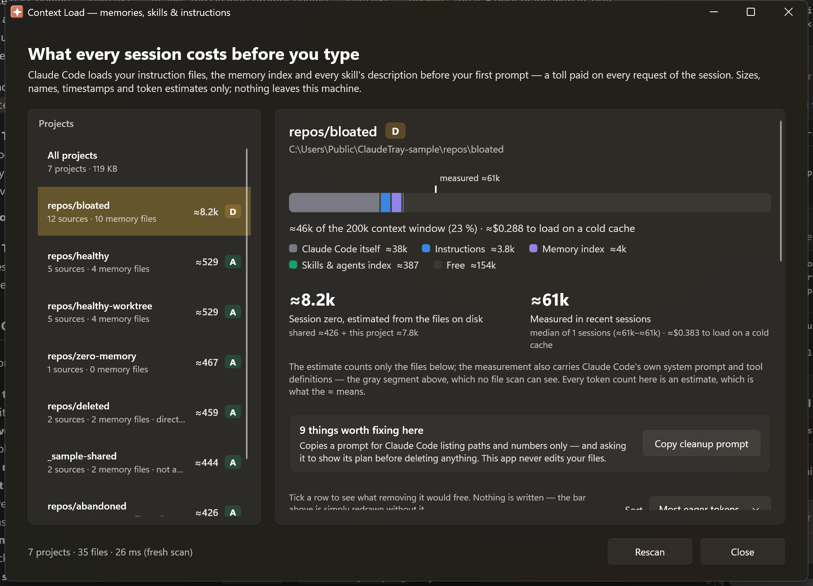
</div>

Claude Code loads your instruction files, your memory index and **every skill's description**
before your first prompt. That is a fixed toll paid on *every request* of the session, and it is
normally invisible. The **Context** tab of the window shows the number.

- **Session-zero gauge** — one honest bar of what a session loads against the 200k window, split
  into Claude Code's own ≈32k system prompt and tool definitions, your instructions, your memory
  index and the skill/agent index — with what recent sessions *actually* reported drawn over it as
  a tick. The estimate and the measurement are shown side by side, never blended.
- **Eager vs lazy** — the distinction the whole window hangs off. A 300 KB memory directory can cost
  less per session than one bloated `AGENTS.md`, because memory *bodies* are read only when recalled
  while every skill *description* is loaded every single time.
- **Was it ever actually used?** — skills and agents are annotated `45×` or `never`, mined from your
  own transcripts. *"Never invoked in 90 days, and its description costs ≈180 tokens every session"*
  is a decision; "trim your skills" is nagging.
- **What to fix, and the fix** — grounded findings (oversized memory index, index pointers to
  deleted files, memory directories duplicated between worktrees, project directories whose repo is
  gone, 500-character skill descriptions, 40 KB of accumulated permissions…), each with one plain
  sentence and the concrete remedy.
- **What-if** — tick rows to see what removing them would free, live, before touching anything.
- **A–F grade and drift** — a grade per project, plus *"+620 tokens (+2.4 KB) in the last 7 days"*
  and a sparkline, because bloat arrives one memory at a time.

An **All projects** view carries what no single project can show: total footprint, the ten heaviest
loads, and the duplicated memory directories and dead project directories that are only visible
*between* projects.

**The app never edits your files.** The one action on a finding is **Copy cleanup prompt** — it puts
paths and numbers on your clipboard for Claude Code to act on, asking it to show its plan before
deleting anything. Measuring is a read; rewriting your memory directory on a size heuristic is not.

Command line, all of it local:

```
--context                     per-project table
--context --check             findings, grouped by severity
--context --usage             which skills/agents were actually invoked (90d)
--context --prompt [project]  the cleanup prompt the window copies
--context-report report.md    the whole picture as one markdown file
--context --sample            a bundled fixture where every rule fires
```

Only **sizes, names, timestamps and token estimates** are ever read — never file contents — and
nothing leaves your machine. Token counts are estimates and always carry a visible `≈`; there is no
tokenizer bundled, by design.

## Profiles — work and personal, one tray

Claude Code keeps **one account per configuration folder**: `.claude.json` holds a single account and
`/login` replaces it. So running a work login and a personal one on the same Windows means two folders
(`CLAUDE_CONFIG_DIR`), each with its own credentials, projects, memory, settings and MCP servers.

**Settings → Claude Code → Profiles** manages that list, and the tray's **Open Claude Code** turns into
a submenu — one entry per profile:

- **Add** — pick (or create) a folder. Nothing is written into it: Claude Code creates its own files
  there, and the sign-in happens in Claude Code. A profile with no login yet is marked in the menu, and
  its entry runs `claude auth login` (with your address prefilled if the folder already knows it).
- **Name** — free text, only for the menu. Left empty it uses the organization, else the folder name.
- **Working directory** — per profile, so one click can't open your work account inside a personal repo.
- **Remove** — from the tray's list only. **The folder, its login, its transcripts and its memory are
  never touched**, and if it's still discoverable it comes back as a found profile.

**Every registered profile is polled**, each with its own login, and each keeps its own usage history —
so a profile you are not currently watching still builds the history it needs if you switch to it. A
profile that isn't on the subscription (an API key, Bedrock, Vertex) is **not** polled: there is no quota
window to read, and calling it would spend money to learn nothing. Because each poll spends a sliver of
*that* account's usage, the cost estimate under **Settings → General → Interval** multiplies by the
number of profiles being polled and says so.

The **Statistics** window reports on one profile at a time and says which: with more than one, a picker
at the top switches it, and everything below — the charts, the projection, the activity shape, last week's
ghost and the live throughput — is recomputed from that profile's own readings and its own transcripts. A
profile the icon isn't following is drawn from its last stored reading, with the footer saying when that
was; one with nothing stored yet says so rather than borrowing another account's numbers.

The tray icon is one number, so one profile owns it — the **Profile** submenu says which, shows the
others' readings beside them, and switches with a click. A profile that needs a sign-in says so on its own
line, rather than a generic prompt that would send you to re-login on the wrong account. (The tooltip only
names the monitored profile: Windows caps a tray tooltip at 127 characters, which is why the numbers live
in the menu.) That submenu is the only place you change it **by hand** — the Claude Code settings page names
profiles and edits them, but switching one is a click on the tray, not a trip through Settings and Save.
Two things move the icon without a click: **Follow the active profile** (below), and a pinned profile that
is no longer on the machine, which falls back to the default one. However it changes hands, everything held
about the outgoing account is dropped in the same breath — its reading, its projection history, its
overage spell and its sign-in state — so nothing measured on one login is ever drawn under another.

**The icon says whose number it is.** With more than one profile registered, it wears a thin coloured band
along its top edge — one colour per profile, so a glance tells you which account the percentage belongs to
without opening anything. The band's colours (violet, pink, periwinkle) are deliberately none of the ones
the icon already uses to mean something: the fill still goes green when you're on track and orange→red when
you're projected to run out, and the band can never be mistaken for either. With a single profile there is
no band, since there would be no question to answer.

**Or let the icon keep up by itself.** Turn on **Follow the active profile** — in the Profile submenu, or
in **Settings → Claude Code → All profiles** — and the icon moves to whichever profile Claude Code last worked
in, so switching accounts needs no click at all. It is read from **transcript timestamps only**, on the
same refresh you already pay for: no transcript is opened, nothing runs between refreshes, and a profile
with no subscription quota to read is never followed into. The submenu shows how long ago each profile was
active. **Choosing a profile by hand pins the icon there** — marked "· pinned" in the submenu — until you
click **Resume following**, which appears right below the toggle once something is pinned. A held pick
used to expire the moment a turn landed anywhere else, which on a continuously-active profile could be
seconds after the click; the click is the strongest signal the app gets, so undoing it now takes one too.
Off by default.

Switching *which account a session uses* happens when Claude Code launches: the tray passes
`CLAUDE_CONFIG_DIR` and gets out of the way. It never writes to a configuration folder and never moves credentials between them — Claude Code
rewrites its own credentials file on every token refresh, so shuffling those files around is how you
lose a login. A running session keeps the profile it started with; a change applies to the next one.
That variable is passed **to the session it launches**. Which profile that selects is worked out
against what the session would otherwise inherit: for the folder a bare `claude` already uses the tray
passes nothing — and if something on your machine points `CLAUDE_CONFIG_DIR` elsewhere, it **clears**
the variable for that session instead, because pointing it *at* `~/.claude` would start Claude Code
against a second, empty state file instead of your own project history.

**A pick says how far it reaches.** Hovering a profile in the submenu tells you what choosing it does:
move the tray only, or set the profile everywhere in Windows — and either way it is about sessions
started from then on, never one already running.

**And the submenu answers the other question too.** The check mark says whose numbers the icon is
drawing; that is not the same as which profile a *new* session starts in. When `CLAUDE_CONFIG_DIR`
names a different profile, that one is marked **· set in Windows** — and when it points at a folder
none of your profiles covers, the submenu says so and names it. Agreement is the normal case and
passes without ceremony; the disagreement is the whole point, because it is the one that makes
`/usage` report an account you weren't expecting.

**Want the profile you pick to be the whole machine's?** Turn on **Use the chosen profile everywhere in
Windows** — it sits right in the **Profile** submenu, below **Follow the active profile**, so the wider
switch is where the picking happens and not something you have to go find; **Settings → Claude Code →
All profiles** has the same switch with the variable's live value beside it. Then picking a profile by hand writes
`CLAUDE_CONFIG_DIR` into your Windows user environment, so a terminal you open yourself, an editor
started from the Start menu and anything else use that profile too — not only the sessions the tray
launches. It follows the profile you **choose**, never the one auto-follow drifts to, and the row shows
the variable's live value beside the switch. Programs already running keep the profile they started
with. Off by default, and reversible by design: turning it off, or clicking **Resume following**, puts
the variable back exactly as it was — the tray does not leave behind a setting it no longer manages.

With it on, **Open Claude Code** goes back to being a single command: the profile is already chosen for
the whole machine, so every entry of the submenu would open the same one. It still says **— sign in** and
takes you to the login when that profile has no credentials stored yet. Turn the switch off and the
per-profile submenu comes back exactly as it was.

Prefer to do it yourself? The **Terminal default** row still shows the exact
`setx CLAUDE_CONFIG_DIR "<dir>"` command with a **Copy** button, and the tray only copies it. (Hidden
for your default profile and for `~/.claude`, where that command would be the wrong thing to run.)

> A fresh profile starts genuinely empty — no user `CLAUDE.md`, settings, skills, plugins or project
> history. That isolation is the point, but it does mean the second profile won't inherit your setup.

## System information — your plan, your install, this machine

**Settings → System information** answers the questions you would otherwise dig out of JSON by
hand: which plan this login is on, who it belongs to, where Claude Code keeps its configuration,
and what this machine is.

<div align="center">
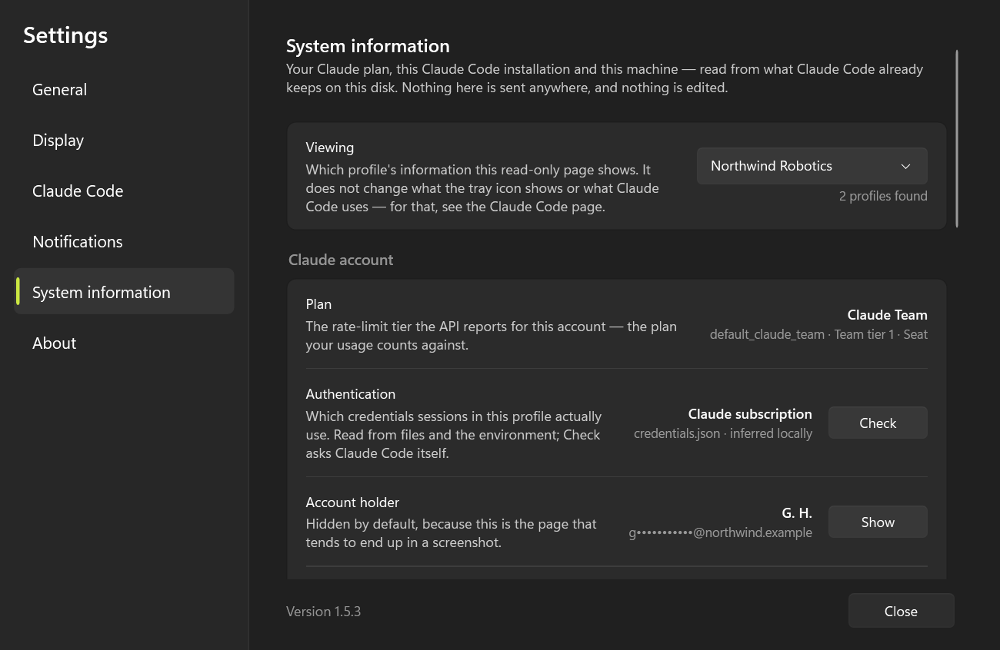
</div>

- **Profile** — Claude Code keeps one account per **configuration folder**, so several logins on one
  machine means several folders (`CLAUDE_CONFIG_DIR`). The tray finds them all — the default one, any
  set through a settings file, and anything following the `~/.claude-*` naming convention — and, when
  there is more than one, offers a picker that re-reads the whole page from that profile's own files.
  One account reached through two paths is listed once. With a single profile the picker stays hidden.
- **Authentication** — which credentials sessions in this profile actually use, and whether that draws
  on your subscription at all. `CLAUDE_CONFIG_DIR` separates folders but **not** environment auth: with
  an `ANTHROPIC_API_KEY` set, a folder you've never signed into runs on that key, bills per use, and
  never touches the 5-hour or weekly windows — so the plan, the percentages and the tray icon aren't
  describing it. The page says so in as many words, and **Check** asks Claude Code itself
  (`claude auth status`) for the authoritative answer. Only the *presence* of a key is ever read.
- **Plan** — the rate-limit tier the API reports for the account, named the way you'd say it
  (*Claude Max 5x*), with the raw tier, seat and billing type underneath. A tier the app doesn't
  recognize is shown verbatim rather than hidden.
- **Account holder & organization** — name, email, workspace and your role in it. **Masked by
  default** (`A. O.` / `a•••••@example.com`, and paths folded back to `~`) because this is the page
  that tends to end up in a screenshot attached to a bug report; one click reveals it, another hides
  it again.
- **Extra usage · using since · sign-in** — whether the account may keep working past the included
  limits, when this login first spent a token through Claude Code, and how long the stored sign-in
  is valid (Claude Code refreshes it as you work, so an expired one is not a problem). When the API
  is **refusing** extra usage — an organization that has turned it off, say — the row says so and
  names the reason, instead of reading "enabled" from a local file that cannot see the refusal.
- **The Claude Code install** — installed CLI version, install method, auto-update state, the
  configuration folder (with **Open**, and it honours `CLAUDE_CONFIG_DIR`) and how many projects it
  tracks.
- **This app & machine** — the running tray version and where it runs from, the Windows build, the
  .NET runtime and the architecture — the lines a bug report asks for.
- **Copy for a bug report** — the whole page as plain text, exactly as displayed: a masked holder
  stays masked in the clipboard too.

<div align="center">
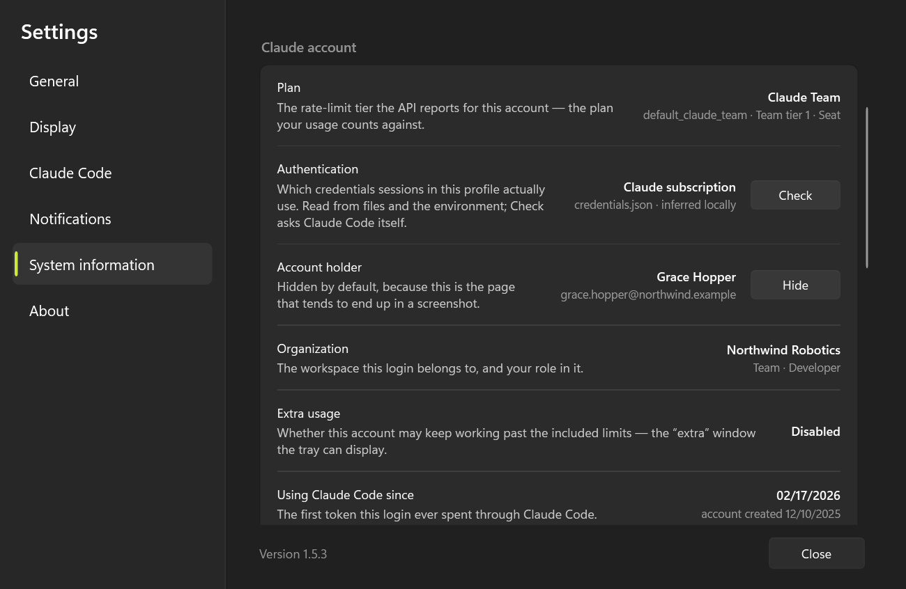
</div>

> Both shots are of a **sample account** — a fictional Team seat the app builds on demand, which is how
> this page gets published at all: masking hides a name and the local part of an address, but an
> organization and its mail domain *are* the reading. The second one is the same page after **Show**.

Every reading comes from what Claude Code already keeps on your disk (`.claude.json`,
`.claude/.credentials.json`): no API call, nothing written, no transcript touched — and no secret
displayed, since the credentials file is read only for its expiry, subscription type and how many
permissions were granted.

## Data source

A minimal call to the Anthropic API (Haiku, 1 token) every 5 min reads the
`anthropic-ratelimit-unified-*` headers, using the OAuth token Claude Code keeps in
`~/.claude/.credentials.json`. No extra configuration. The usage-insights submenu instead
reads the local session transcripts (see above).

## Credentials (setup)

There is **nothing to configure manually** — the app reuses Claude Code's own credentials.
On each poll it reads the OAuth token from:

```
%USERPROFILE%\.claude\.credentials.json
```

looking up the `claudeAiOauth.accessToken` field. That file is created and refreshed
automatically by Claude Code when you log in. There is no API key to paste and no
environment variable to set.

1. **Install Claude Code** (if you don't have it yet).
2. **Log in at least once** by running `claude` in a terminal — this writes
   `~/.claude/.credentials.json` with the OAuth token.
3. **Run the tray app** — it finds the file on its own (see
   [Build and run](#build-and-run)).

If you want to confirm the token exists, check that
`%USERPROFILE%\.claude\.credentials.json` contains `claudeAiOauth.accessToken`. When the
token expires the icon turns amber and the tooltip reads **not authenticated** — right-click →
**Open Claude Code** (or run `claude` yourself) to refresh it, then **Refresh now** (see
[Troubleshooting](#troubleshooting)).

## ⚠️ Authentication & Anthropic's terms — please read

This tool reuses your **subscription** OAuth token (`claudeAiOauth.accessToken`) to make a
minimal, automated call to the Anthropic Messages API on each poll, purely to read the
`anthropic-ratelimit-unified-*` headers. You should understand how that sits with Anthropic's
current terms before relying on it.

Anthropic's [Claude Code legal & compliance docs](https://code.claude.com/docs/en/legal-and-compliance)
state (verbatim):

> **OAuth authentication** is intended exclusively for purchasers of Claude Free, Pro, Max,
> Team, and Enterprise subscription plans and is designed to support **ordinary use of Claude
> Code and other native Anthropic applications**.
>
> **Developers** building products or services that interact with Claude's capabilities …
> **should use API key authentication** through Claude Console or a supported cloud provider.
> Anthropic does not permit third-party developers to **offer Claude.ai login** or to **route
> requests through Free, Pro, or Max plan credentials on behalf of their users**.
>
> Anthropic reserves the right to take measures to enforce these restrictions and **may do so
> without prior notice**.

What this means for this tool:

- **It is *not* the explicitly prohibited case.** It does not offer Claude.ai login to anyone
  and does not route requests *on behalf of other users* — it runs locally, single-user, with
  **your own** credentials, for **your own** individual use.
- **It *is* a gray area.** A self-directed, automated API call from a non-native app arguably
  falls outside "ordinary use of Claude Code." Use it at your own discretion and risk.
- **`claude setup-token` is *not* a fix.** That token is *scoped to inference only*, is reported
  to be **rejected by the Messages API** (so it likely wouldn't work here), and is still a
  subscription credential under the same Consumer Terms — it changes nothing legally.
- **There is no fully "clean" alternative that keeps this feature.** The unified subscription
  rate-limit headers only exist on subscription OAuth credentials; an API key (the path
  Anthropic points developers to) would report *API* limits, not your subscription's.
- **To minimize exposure**, keep the refresh interval conservative (Settings → refresh interval)
  — every poll is one automated API call, and the tray never has two polls of one account in flight
  at once, so the interval you set is a ceiling rather than an average.

Governing terms: [Consumer Terms](https://www.anthropic.com/legal/consumer-terms) (Free/Pro/Max),
[Commercial Terms](https://www.anthropic.com/legal/commercial-terms) (Team/Enterprise/API),
[Usage Policy](https://www.anthropic.com/legal/aup).

## Requirements

- Windows 10/11
- .NET 10 SDK (to build) — the self-contained `.exe` does not require .NET to be installed to run
- Claude Code installed and logged in (run `claude` at least once)

## Build and run

```
dotnet run -c Release            # build and run
```

### Produce a single .exe (self-contained, no dependencies)

```
dotnet publish -c Release
```

The executable is emitted at `bin\Release\net10.0-windows\win-x64\publish\ClaudeTray.exe`.
It can be copied anywhere and runs without .NET installed.

### Start with Windows

Three ways, from simplest to most complete:

1. **From Settings** (recommended): click the icon → **Settings** → **Startup** →
   **Start with Windows**. Writes/removes a key under `HKCU\…\Run` pointing to the current `.exe`. No admin.
2. **Installer** (see below): check "Start with Windows" during installation.
3. **Manual**: `Win + R` → `shell:startup` → create a shortcut to `ClaudeTray.exe`.

### Build the installer (Inno Setup)

Requires [Inno Setup 6](https://jrsoftware.org/isdl.php).

From the repo root:

```
dotnet publish -c Release
"C:\Program Files (x86)\Inno Setup 6\ISCC.exe" build\installer.iss
```

Produces `dist\ClaudeTray-Setup.exe` — a per-user install (no admin) at
`%LocalAppData%\ClaudeTray`, with a Start Menu shortcut, an autostart option and an
uninstaller. The script is [build/installer.iss](build/installer.iss); everything that
exists to *ship* the app (the build and release scripts, the winget manifests) lives in
[build/](build/), and each script can be run from anywhere — it resolves the repo root itself.

### Releasing a new version

The version lives in **one place**: `<Version>` in [ClaudeTray.csproj](ClaudeTray.csproj).
Everything else derives from it — `installer.iss` reads it from the built `.exe`. To cut a
release:

```
# 1) bump <Version> in ClaudeTray.csproj, then:
build\build-installer.cmd                 # publish + build dist\ClaudeTray-Setup.exe
```

Then create a GitHub release tagged `vX.Y.Z` and attach `ClaudeTray-Setup.exe`. Existing
installs pick it up automatically (see [Updates](#updates)).

## The window (click the icon)

A **left-click on the tray icon** opens the app's one window, on the pacing report. A strip along
the top switches between its three destinations, so nothing needs a second window:

- **Statistics** — the pacing report: 5h session, 7d week and live throughput (see above)
- **Context** — what every session in a project loads before your first prompt (see above)
- **Settings** — refresh interval, display options, notifications, **Start with Windows**
  (autostart), profiles, and **System information** (your plan, this Claude Code install and this
  machine)

Each destination remembers where you left it while the window is open — a scan, a chart, a
half-edited settings page all survive switching to another one and back.

## Menu (right-click the icon)

The menu is what can be done *without* the window:

- **Open** — the same window a left-click on the icon opens (in bold: it is the menu's default action,
  and the only route to the window without a mouse)
- **Show on icon** — Session 5h / Week 7d / Extra (remembered across restarts)
- **Usage insights (24h)** — local cost breakdown from session transcripts (see below)
- **Refresh now** — immediate API read
- **Open Claude Code** — launches the Claude Code CLI so it re-authenticates and refreshes the
  OAuth token; the recovery path when the icon shows a *not authenticated* (HTTP 401) state
- **Update to vX.Y.Z** — appears only when a newer GitHub release exists; click to download and
  install it (see below)
- **Profile ▸ &lt;name&gt;** — with more than one profile, this submenu shows each one's current usage and
  which one the icon is following; click another to switch the icon to it
- **Open Claude Code ▸ &lt;profile&gt;** — with more than one profile registered, this becomes a submenu:
  each entry launches Claude Code with that profile's configuration folder and its own working
  directory (see below). It stays a single command when the chosen profile is the whole machine's
- **Quit**

## Updates

The app checks GitHub Releases on launch and every 6 hours. When a newer release is published,
it shows a notification balloon and an **Update to vX.Y.Z** menu item. Clicking either downloads
`ClaudeTray-Setup.exe` from that release to `%TEMP%` and runs it silently; the app closes so its
`.exe` can be replaced, the installer upgrades in place (same `AppId`), and relaunches it. No
admin rights are needed — it's a per-user install.

Publishing a new version is just: bump `<Version>` in `ClaudeTray.csproj` (and `installer.iss`),
build the installer, and attach `ClaudeTray-Setup.exe` to a GitHub release tagged `vX.Y.Z`.

## Structure

The sources live under `src/`, one folder per subsystem — `src/Tray/` (the resident app),
`src/Cli/` (the headless developer flags), `src/Usage/` (quota, spend, live throughput),
`src/Context/` (the Context Load Inspector),
`src/Profiles/` (accounts and settings), `src/Core/` (localization and the safe directory walk) and
`src/Ui/` (the four windows, as `.xaml`/`.xaml.cs` pairs). The namespace is flat (`ClaudeTray`), so
the folders are for reading, not for the compiler.

| File | Responsibility |
|---|---|
| `src/Tray/Program.cs` | entry point: `Main` and the arg dispatch |
| `src/Tray/TrayContext.cs` | the resident app — `ApplicationContext`, tray icon, menu, poll/flash timers |
| `src/Cli/` | the headless printers behind the developer flags, one file per flag family |
| `src/Usage/ApiClient.cs` | reads credentials, calls the API, parses the rate-limit headers |
| `src/Usage/BurnTracker.cs` | tracks utilization history, estimates the burn rate, projects exhaustion |
| `src/Usage/UsageInsights.cs` | aggregates the last 24h of session transcripts into a cost-weighted breakdown |
| `src/Profiles/ClaudeAccount.cs` | reads the local Claude Code config for the plan, holder, org and install shown on the System information page, and discovers every profile (config dir) on the machine (read-only, no secrets) |
| `src/Tray/IconRenderer.cs` | draws the icon with GDI+ (vector + outline + projection dot) at the actual size |
| `src/Tray/Updater.cs` | checks GitHub Releases and downloads/runs the installer for in-app self-update |

> Dev tips: `dotnet run -- --render <dir>` dumps sample PNGs at 16/20/32 px for visual
> inspection; `dotnet run -- --insights` prints the 24h usage breakdown to the console;
> `dotnet run -- --makeicon ClaudeTray.ico` regenerates the app icon (multi-resolution `.ico`).

## Troubleshooting

- **Logo icon (spark)** → still connecting; wait for the first call.
- **"not tracking yet" tooltip** → the access token expired but a refresh token is on disk, so no
  login is needed. Just start using Claude Code again (or right-click → **Open Claude Code**);
  launching it silently refreshes the token and your usage reappears. Common on the first poll
  after a reboot.
- **"not signed in" tooltip** → there's no refresh token (or no credentials file at all), so a full
  login is required. Right-click → **Open Claude Code**, type `/login`, then **Refresh now**.
- **Amber icon / "API error" tooltip** → a network/API problem. Check connectivity and retry.
- **Only one icon even if launched twice** → by design: a named mutex enforces a single
  instance, so re-running the `.exe` while it's already in the tray just exits silently.

## License

[Apache License 2.0](LICENSE) © 2026 Alexandre Oliveira. Unofficial, community-built — not
affiliated with Anthropic.
